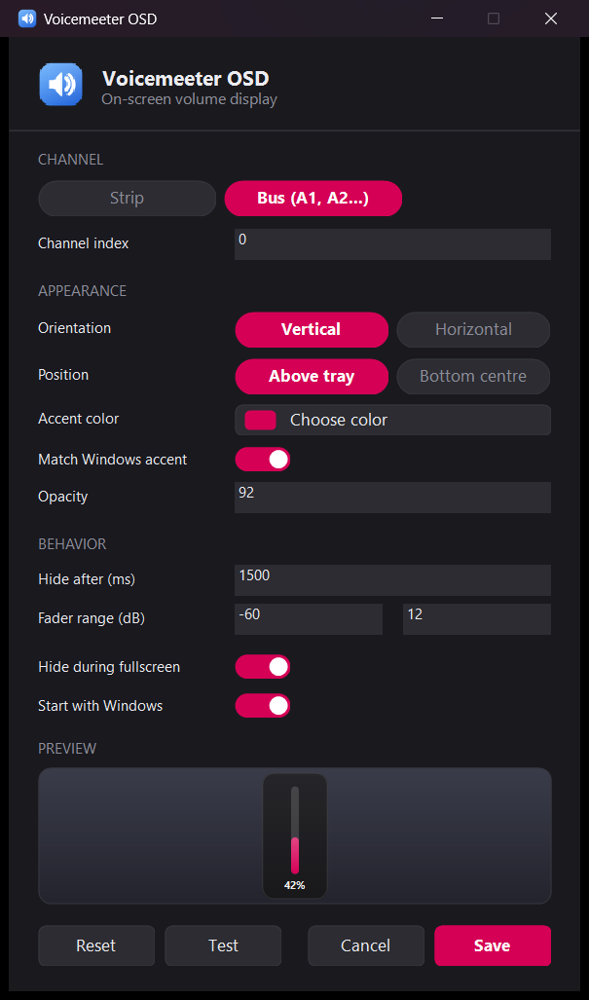

# Voicemeeter OSD

An on-screen volume display for [Voicemeeter](https://vb-audio.com/Voicemeeter/). Voicemeeter has no
equivalent of the Windows volume popup, so when a hardware knob or a MIDI control moves a fader there
is no visual feedback unless the Voicemeeter window is in front of you.

This is a small tray app that watches a strip or bus and shows a bar whenever its level changes —
or every channel at once, if you'd rather it follow whichever fader moved.

<p align="center">
  
</p>

## Features

- **Pops out of the tray icon.** The bar grows out of the notification-area icon and retracts into it,
  with a callout tail pointing back at the icon.
- **Live VU meter** next to the fader, with a peak marker that falls away slowly — so you can see the
  signal, not just the setting. A tick marks unity (0 dB) gain.
- **Follows whichever channel moved.** Turn on "Follow any channel that moves" and a fader, mute
  button or hardware control on any strip or bus pops the bar with that channel's name.
- **Vertical or horizontal**, docked above the tray, floating at the bottom centre of the screen, or
  **dragged anywhere** — drag the bar to park it and it remembers the spot.
- **Reads the level, the dB value and the channel name** — using the label you typed in Voicemeeter
  if you set one, otherwise `A1`, `B2`, `Strip 3` and so on.
- **Scroll the tray icon** to change the volume, or use global hotkeys — by default
  `Ctrl+Alt+↑` / `Ctrl+Alt+↓` nudge the fader and `Ctrl+Alt+M` toggles mute, and all three can be
  rebound (Backspace clears one). You're warned if another app already owns a shortcut. The step
  per notch or press is adjustable. Scrolling and hotkeys always act on the channel you picked in
  settings, even when the bar is following another one.
- **Click the bar** to bring up the Voicemeeter window, **scroll over it** to adjust, or
  **middle-click** to mute. Hovering keeps it on screen. Precision touchpads scroll smoothly too.
- **Right-click the tray icon** to mute, switch channel or open Voicemeeter without going into
  settings.
- **Multi-monitor aware**, including per-monitor DPI. Docked mode follows the display that owns the
  tray; floating mode follows the display you are working on.
- **Stays out of the way** of fullscreen games and presentations.
- **Recovers on its own** if Voicemeeter starts after it, restarts, or switches edition, and if
  Explorer restarts and takes the tray with it.
- Optional **Windows accent colour** matching, adjustable opacity, timeout and fader range.
- Runs at startup if you want it to, and installs itself somewhere stable when you enable that.

## Requirements

- Windows 10 or 11
- Voicemeeter, Voicemeeter Banana, or Voicemeeter Potato

## Install

Download `voicemeeter-osd.exe` from the [latest release](../../releases/latest) and run it. There is
no installer and nothing to unpack — it is a single binary with no runtime dependencies beyond the
system DLLs that ship with Windows.

It appears in the notification area. On Windows 11 new tray icons start hidden behind the `^` chevron;
drag it onto the taskbar to keep it visible. If you lose track of it, run the exe again — that opens
the settings of the copy that's already running.

The release binary isn't code-signed, so Windows SmartScreen may warn the first time you run it
("Windows protected your PC"). Choose **More info → Run anyway**, or build it yourself from source.

To have it start with Windows, turn on **Start with Windows** in settings. That copies the binary to
`%LOCALAPPDATA%\Programs\VoicemeeterOSD\` and points the startup entry there, so it keeps working if
you move or delete the copy you downloaded. Running a newer download later refreshes that copy.

## Setup

Right-click the tray icon and choose **Settings**.

The one thing you need to get right is **which channel to watch**. Pick it from the **Channel** list,
which shows every strip and bus your edition has, along with any label you've given it in
Voicemeeter. If you're not sure which one your knob drives, move it with Voicemeeter open and see
which column responds — or turn on **Follow any channel that moves**.

If the percentage doesn't line up with where the fader looks, adjust the **fader range** — Voicemeeter
faders run from -60 dB to +12 dB by default, and the percentage is mapped across that range.

Settings are stored in `%APPDATA%\voicemeeter-osd\settings.txt`. Turning on **Debug log** in settings
writes a timestamped trace to `%APPDATA%\voicemeeter-osd\debug.log` (rotated to `debug.log.1` at
1 MB) — useful if the bar isn't appearing when you expect it to.

Scrolling the tray icon uses a low-level mouse hook. If you'd rather not have one installed (some
anti-cheat software notices them), turn off **Scroll tray icon for volume**.

## Building

Requires a Rust toolchain with the MSVC target, and the Windows SDK for `rc.exe` if you want the icon
embedded in the executable (it builds fine without, just without a file icon).

```sh
cargo build --release
```

The result is a single `voicemeeter-osd.exe` with the icon and version info embedded and the C
runtime statically linked — it runs on a clean Windows install with nothing to install alongside.
Pushing a tag publishes it: `git tag v0.1.0 && git push origin v0.1.0` triggers the release
workflow, which checks the tag matches the version in `Cargo.toml`, runs the same format, lint and
test gates as CI, builds the exe and attaches it to a GitHub Release with generated notes.

The icon is generated rather than hand-drawn; `tools/make_icon.ps1` redraws it at every size and packs
the `.ico`. `tools/watch_params.ps1` logs every strip and bus gain, which is a quick way to find out
which parameter a hardware control actually drives.

## How it works

It talks to Voicemeeter through `VoicemeeterRemote64.dll`, the Remote API that ships with Voicemeeter,
polling the watched channel and showing the bar when the value changes.

The bar is a layered window drawn with GDI+ into a premultiplied-ARGB surface and pushed through
`UpdateLayeredWindow`, which is what gives it antialiased corners, a soft shadow and per-pixel
transparency. There is no web view and no UI framework — the whole thing is Win32 plus one crate
(`windows-sys`), which keeps the binary around 400 KB.
